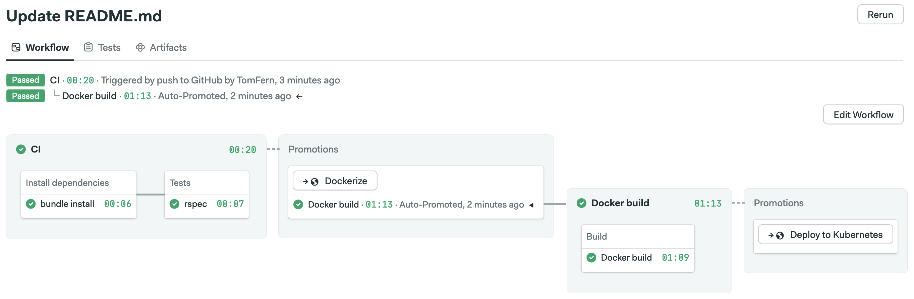

# Semaphore CI/CD demo for Kubernetes

[](https://semaphore-demos.semaphoreci.com/projects/semaphore-demo-ruby-kubernetes-eins)

This is an example application and CI/CD pipeline showing how to build, test and
deploy a microservice to Kubernetes using Semaphore 2.0.

Ingredients:

- Ruby Sinatra as web framework
- RSpec for tests
- Packaged in a Docker container
- Container pushed to Docker Hub registry
- Deployed to Kubernetes

## CI/CD on Semaphore

If you're new to Semaphore, feel free to fork this repository and use it to
[create a project](https://docs.semaphoreci.com/article/63-your-first-project).

The CI/CD pipeline is defined in `.semaphore` directory and looks like this:



## Local application setup

To run the microservice:

```
bundle install --path vendor/bundle
bundle exec rackup
```

To run tests:

```
bundle exec rspec
```

To build and run Docker container:

```
docker build -t semaphore-demo-ruby-kubernetes .
docker run -p 80:4567 semaphore-demo-ruby-kubernetes
curl localhost
> hello world :))
```

## Additional documentation

- [CI/CD for Microservices on DigitalOcean Kubernetes](https://semaphoreci.com/blog/cicd-microservices-digitalocean-kubernetes)
- [CI/CD for Microservices on Kubernetes](https://docs.semaphoreci.com/examples/ci-cd-for-microservices-on-kubernetes)

## License

Copyright (c) 2022 Rendered Text

Distributed under the MIT License. See the file LICENSE.
